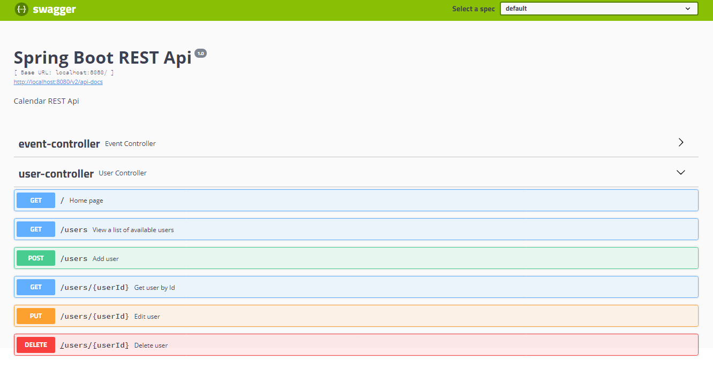
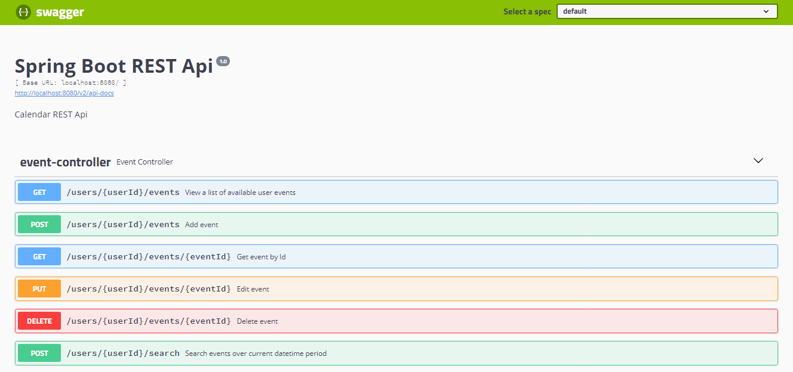
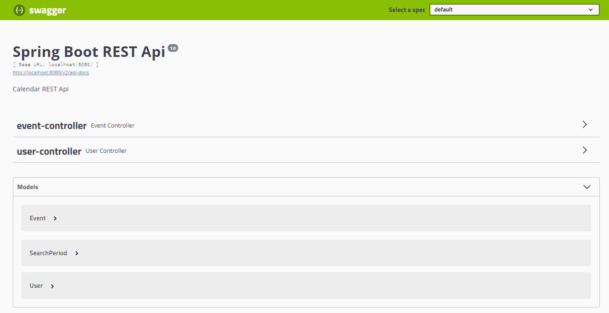

# Calendar Rest service
### *(Spring Boot + Data JPA + PostgreSQL + Swagger + JUnit)*

 
Программа представляет собой серверную часть приложения (без UI части) по работе с пользователями и событиями, связанными с их календарем.
Предоставляет REST API для:

* получения списка всех пользователей (авторов событий);

* создания, получения (по id), удаления, редактирования пользователя;

* создания, получения (по id), удаления, редактирования события пользователя в календаре;

* получения списка всех событий в календаре пользователя;

* поиска событий пользователя за определенный промежуток времени;

Документация к работе сервиса оформлена с помощью Swagger и доступна во время работы программы по адресу 
[swagger-ui.html](http://localhost:8080/swagger-ui.html/).
 

 

## Запуск приложения
1. Git [clone](https://github.com/Laboulaye/calendar-rest-service.git)
2. Создать базу данных *calendar*
3. В файле *resources/application.properties* изменить данные *username/password* на свои

## Работа приложения
Во время запуска приложения в базе данных создаются две связанные таблицы: "Пользователи" и "События". Также во время запуска выполняется sql-скрипт, наполняя базу данных некоторыми начальными значениями.
Функционал Rest Api описан в документации с помощью Swagger. При попытке обратиться в url-адресе к несуществующим Пользователям или Событиям программа показывает соответствующее сообщение.

 
 

 

 

